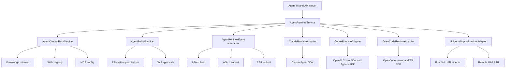

# Agent Runtime Upstream Preservation Plan

Project: The Boss / Cherry Studio fork
Phase: agent-assistant-upstream-assessment
Date: 2026-04-17
Planner: Codex
Mode: KBD native plan, no OpenSpec directory detected
Implementation status: review-only plan, no code changes in this phase

## Executive Summary

The fork should not keep extending the upstream Claude Agent SDK path by pretending non-Anthropic providers are Anthropic-compatible. That is the main architectural conflict with upstream intent. Upstream's agent design is a dedicated, main-process/API-backed, filesystem-scoped agent subsystem using the Claude Agent SDK. It is separate from assistant chat, has its own SQLite/Drizzle persistence, and assumes Claude-style execution semantics: permissions, workspace files, MCP, resumable sessions, and Claude SDK events.

The preservation strategy is:

1. Keep the upstream Claude Agent SDK implementation as the Claude runtime, with only narrow branding, security, and compatibility fixes.
2. Add a runtime adapter layer beside it, not inside it.
3. Add Codex via the official OpenAI Codex SDK and OpenAI Agents SDK surfaces.
4. Add OpenCode via its headless server and generated TypeScript SDK.
5. Add Universal Agent Runtime as an optional runtime, with two modes only: bundled embedded sidecar or remote URL.
6. Move knowledge base and skills support into one runtime-neutral "context pack" service that each runtime adapter consumes through its native capabilities.
7. Fix migrations by appending fork migrations after the current upstream journal tail and adding a one-time reconciliation/compatibility check for all fork-added columns.

This keeps future upstream merges tractable because upstream files are no longer the integration point for every new agent engine.

## Research Summary

### OpenAI / Codex

Official OpenAI docs now expose a Codex SDK. The TypeScript package is `@openai/codex-sdk`, is server-side, requires Node.js 18+, supports starting and resuming Codex threads, and is intended for programmatic control of local Codex agents in CI/CD, internal tools, and applications. Source: [OpenAI Codex SDK](https://developers.openai.com/codex/sdk).

OpenAI also documents the TypeScript Agents SDK as a code-first agent framework with agents, handoffs, guardrails, function tools, MCP server tool calling, sessions, human-in-the-loop, and tracing. Source: [OpenAI Agents SDK TypeScript](https://openai.github.io/openai-agents-js/) and [Agents SDK guide](https://developers.openai.com/api/docs/guides/agents).

The Agents SDK includes an experimental Codex tool in `@openai/agents-extensions/experimental/codex`, which wraps `@openai/codex-sdk` as a tool. The docs call out workspace-scoped tasks, shell, file edits, MCP tools, Codex streaming events, thread IDs, usage, and safety options such as `sandboxMode` plus `workingDirectory`. Source: [OpenAI Agents SDK tools guide](https://openai.github.io/openai-agents-js/guides/tools/).

OpenAI Sandbox Agents are also relevant for future parity because the documented capabilities include Shell, Filesystem, Skills, Memory, and Compaction. The docs explicitly say the Skills capability should be used for skill discovery/materialization rather than manually mounting `.agents` paths. Source: [OpenAI Sandbox Agents](https://developers.openai.com/api/docs/guides/agents/sandboxes).

Conclusion: a Codex/OpenAI runtime can be first-class and does not need to route through the Claude Agent SDK or a Claude compatibility proxy.

### OpenCode

OpenCode has a headless server mode: `opencode serve`. It defaults to `127.0.0.1:4096`, publishes an OpenAPI 3.1 spec at `/doc`, supports optional HTTP Basic auth through `OPENCODE_SERVER_PASSWORD`, and is intended for programmatic clients. Source: [OpenCode server docs](https://opencode.ai/docs/server/).

The official JS/TS SDK package is `@opencode-ai/sdk`. It can start a server and client, and exposes typed APIs for health, providers, config, sessions, messages, commands, shell, files, auth, and SSE events. Source: [OpenCode SDK docs](https://opencode.ai/docs/sdk/).

OpenCode supports noninteractive CLI runs, including attaching to a running server: `opencode run --attach http://localhost:4096 ...`. Source: [OpenCode CLI docs](https://opencode.ai/docs/cli/).

OpenCode uses the AI SDK and Models.dev for broad provider/model coverage, including local models. It supports custom providers through AI SDK packages such as `@ai-sdk/openai-compatible`, and provider/model IDs are configured as `provider/model`. Sources: [OpenCode models](https://opencode.ai/docs/models), [OpenCode providers](https://opencode.ai/docs/providers), and [OpenCode config](https://opencode.ai/docs/config/).

Conclusion: OpenCode should be integrated as its own runtime adapter backed by the server/SDK. It is the right place to route broad non-Anthropic/non-OpenAI model support, not through Claude's SDK.

### Universal Agent Runtime

Local code at `/Users/gqadonis/Projects/prometheus/universal-agent-runtime` defines a Rust binary package named `universal-agent-runtime`. The local `Cargo.toml` license is `AGPL-3.0-only`; this repository's `LICENSE` is also AGPL-3.0 text, so the immediate concern is compliance and source-distribution hygiene rather than a direct license mismatch.

The local runtime already has:

- Embedded SurrealDB/RocksDB config through `config.embedded.yaml`, using `persistence.database_url: rocksdb://./data/uar-dev-db`.
- Remote SurrealDB config through `config.remote.surreal.yaml`.
- OpenAI-compatible `/v1/models` and `/v1/chat/completions` surfaces.
- `/healthz`, `/readyz`, `/metrics`, MCP health, skill reload, provider, compiler, A2A, A2UI, and run streaming routes.
- A TypeScript SDK under `sdks/typescript` with chat, runs, streaming, knowledge, and ingest APIs.
- OpenAPI metadata that describes "MCP tool integration, A2A/AG-UI/A2UI protocol support, and 142+ LLM provider coverage."

Conclusion: UAR is viable as an optional runtime, but it should be isolated behind the same runtime adapter contract. Packaging it as a sidecar is feasible using the existing binary packaging patterns in this repo (`resources/**/*`, `asarUnpack: resources/**`, `resources/binaries/<platform-arch>`, `getBinaryPath`, `toAsarUnpackedPath`, and `spawn`). It should remain optional until build, update, signing, and AGPL source-availability obligations are explicitly handled.

## Non-Negotiable Design Rules

1. Preserve the Claude runtime as upstream-native.
   - Claude Agent SDK stays the default upstream-compatible implementation.
   - No OpenAI, Vertex, Ollama, or other provider emulation inside the Claude runtime.
   - Anthropic REST-compatible providers remain allowed only when they truly expose Anthropic-compatible Messages semantics.

2. Separate runtime choice from assistant chat.
   - Assistant chat settings may display agent-related affordances only when they are scoped to agents.
   - Do not persist new agent or skill state in blocked/deprecated assistant Redux state.

3. Use runtime adapters instead of provider hacks.
   - Claude: Anthropic/Claude Agent SDK.
   - Codex/OpenAI: OpenAI Codex SDK and/or OpenAI Agents SDK.
   - OpenCode: OpenCode server/SDK.
   - UAR: embedded sidecar or remote URL.

4. Knowledge and skills are agent context, not accidental assistant prompt glue.
   - Build one normalized context pack.
   - Map it into each runtime using native capabilities where available.
   - Treat retrieved knowledge and skill text as untrusted external context with prompt-injection guards.

5. Public protocols must be honest.
   - A2A, AG-UI, and A2UI adapters must be documented as fork-specific subsets unless they pass full protocol conformance tests.

6. Migrations must be append-only and upstream-friendly.
   - Never insert fork migrations in the middle of upstream journal history.
   - Append fork migrations after the current upstream journal tail with unique, monotonically increasing tags.
   - Add one reconciliation migration or startup compatibility check for all fork-added columns.

## Proposed Target Architecture



### Runtime Adapter Contract

Create an internal contract similar to:

```typescript
type AgentRuntimeKind = 'claude' | 'codex' | 'opencode' | 'uar'

interface AgentRuntimeAdapter {
  readonly kind: AgentRuntimeKind
  readonly capabilities: AgentRuntimeCapabilities
  validateConfig(config: AgentRuntimeConfig): Promise<ValidationResult>
  healthCheck(config: AgentRuntimeConfig): Promise<HealthResult>
  listModels(config: AgentRuntimeConfig): Promise<RuntimeModel[]>
  createSession(input: CreateRuntimeSessionInput): Promise<RuntimeSession>
  resumeSession(input: ResumeRuntimeSessionInput): Promise<RuntimeSession>
  sendMessage(input: RuntimeMessageInput): AsyncIterable<AgentRuntimeEvent>
  abort(input: AbortRuntimeRunInput): Promise<void>
}
```

The adapter must not expose provider-specific events directly to the public API. It emits a normalized `AgentRuntimeEvent`, then protocol mappers convert that to REST, A2A, AG-UI, or A2UI.

### Runtime Routing

The routing policy should be explicit:

| Desired provider family | Runtime |
|---|---|
| Anthropic REST-compliant or Claude OAuth | Claude runtime |
| OpenAI Codex agent execution | Codex runtime |
| OpenAI API agent workflows not needing Codex workspace operations | Codex/OpenAI runtime through OpenAI Agents SDK |
| Other AI SDK / Models.dev / local providers | OpenCode runtime |
| Maximum flexibility / protocol-rich orchestration / embedded SurrealDB | UAR runtime |

Do not auto-route a provider into Claude just because a compatibility proxy can translate part of the API. If the user chooses a non-Claude model while using the Claude runtime, show an actionable runtime mismatch error and suggest the matching runtime.

## Work To Back Out Or Replace

These should be explicitly reviewed because they are the highest conflict areas:

1. Back out Claude provider emulation for OpenAI and Vertex.
   - Current fork file: `src/main/services/agents/services/claudecode/providerRoutes.ts`.
   - Current behavior returns `compat_proxy_openai` and `compat_proxy_vertex`.
   - Problem: it makes Claude Agent SDK execution depend on non-Claude provider emulation. Tool use, streaming, permissions, model defaults, and error semantics may diverge silently.
   - Replacement: move OpenAI/Codex to `CodexRuntimeAdapter`; move broad provider support to `OpenCodeRuntimeAdapter` or `UniversalAgentRuntimeAdapter`.

2. Back out local Claude compatibility proxy use from the agent runtime path.
   - Current fork files include `src/main/apiServer/services/messages.compat.ts` and `src/main/apiServer/services/messages.ts`.
   - Keep Anthropic public API compatibility only if it is needed for external clients and documented as a compatibility endpoint.
   - Do not use it as the execution engine for Claude Agent SDK with OpenAI/Vertex providers.

3. Back out new persisted Redux `skillConfig` slice for assistant/topic state.
   - Current fork file: `src/renderer/src/store/skillConfig.ts` and root reducer registration in `src/renderer/src/store/index.ts`.
   - Problem: `store/index.ts` is explicitly blocked for feature changes during the v2 refactor. The assistant/topic skill override model also blurs assistant chat and agent execution.
   - Replacement: put runtime skill configuration in the agents SQLite database and expose it through agent settings/API only. If assistant chat needs similar controls later, add them in v2 through the approved data/UI path.

4. Replace "skip skills when knowledge base exists" with deterministic context budgeting.
   - Current dirty worktree change in `src/renderer/src/store/thunk/messageThunk.ts` disables skill injection when an assistant has knowledge bases.
   - Problem: it prevents "knowledge plus skills" parity and hides the collision rather than resolving it.
   - Replacement: `AgentContextPackService` ranks and budgets knowledge chunks, skill metadata, selected skill bodies, and instructions together.

5. Repair migration ordering.
   - Current journal has fork `0007_agent_session_knowledge_access` inserted before later upstream-ish entries `0006_famous_fallen_one` and `0007_strange_galactus`.
   - Problem: this is hostile to future upstream migration merges and can make local migration ordering differ by clone history.
   - Replacement: append a new fork migration after the current tail, for example `0010_theboss_agent_context_pack.sql`, and add a reconciliation check for all fork-added columns.

6. Re-scope public protocol claims.
   - Current A2A/AG-UI/A2UI adapters can stay if documented as subsets and backed by conformance tests.
   - Problem: advertising broad protocol support without conformance coverage creates integration risk.
   - Replacement: publish explicit capability metadata and versioned subset docs.

## Ordered Changes

### Change 001: Upstream Runtime Boundary

Goal: make the upstream Claude path easy to compare and merge.

Tasks:

1. Add an ADR documenting the runtime boundary and why provider emulation is prohibited in the Claude runtime.
2. Create a runtime directory that is fork-owned, for example `src/main/services/agentRuntimes`.
3. Move fork-only runtime orchestration into that directory.
4. Keep `src/main/services/agents/services/claudecode` close to upstream, allowing only:
   - path/packaging fixes,
   - logging,
   - security hardening,
   - Anthropic-compatible provider resolution,
   - test fixtures.
5. Add an upstream parity test that verifies Claude runtime routing rejects OpenAI/Vertex/Ollama unless those providers expose a true Anthropic Messages-compatible endpoint.

Acceptance criteria:

- Claude runtime no longer imports or depends on OpenAI/Vertex compatibility proxy code.
- Provider mismatch errors identify the recommended runtime.
- A contributor can diff the Claude runtime against `upstream/main` without unrelated OpenAI/OpenCode/UAR integration noise.

### Change 002: Migration Repair And Reconciliation

Goal: prevent fork migrations from colliding with future upstream migrations.

Tasks:

1. Determine the current upstream `resources/database/drizzle/meta/_journal.json` tail at implementation time.
2. Move fork schema additions into a new tail migration with a unique monotonically increasing tag.
3. Add a one-time reconciliation migration or explicit startup compatibility check for fork-added columns:
   - `agents.knowledge_bases`
   - `agents.knowledgeRecognition`
   - `agents.knowledge_base_configs`
   - `sessions.knowledge_bases`
   - `sessions.knowledgeRecognition`
   - `sessions.knowledge_base_configs`
   - any new runtime/context-pack columns introduced by this plan
4. Make compatibility repair idempotent and narrowly scoped.
5. Add tests for:
   - fresh DB migration,
   - DB with upstream migrations only,
   - DB with old fork migration already applied,
   - DB with missing fork columns despite migration history.

Acceptance criteria:

- No duplicate `idx` or ambiguous fork tags in the journal.
- Missing fork columns are repaired once without corrupting upstream migration records.
- Migration tests pass independently of current local DB state.

### Change 003: Runtime Adapter Core

Goal: create the common runtime surface without changing runtime behavior yet.

Tasks:

1. Define `AgentRuntimeKind`, `AgentRuntimeAdapter`, `AgentRuntimeCapabilities`, and `AgentRuntimeEvent`.
2. Implement `AgentRuntimeRegistry` with runtime discovery and feature flags.
3. Add `AgentRuntimeService` as the single entry point for agent create/resume/send/abort.
4. Implement a Claude adapter that wraps existing upstream behavior first.
5. Keep public routes unchanged in this change. Only route through the registry internally.

Acceptance criteria:

- Existing Claude sessions still execute through Claude.
- No new provider support is exposed until dedicated adapters land.
- Unit tests cover registry routing, runtime mismatch errors, and normalized event conversion.

### Change 004: Codex / OpenAI Runtime

Goal: add Codex without colliding with Claude.

Tasks:

1. Add `@openai/codex-sdk` as the Codex execution dependency.
2. Add `@openai/agents` and `@openai/agents-extensions` only if the adapter needs OpenAI Agents SDK orchestration or `codexTool`.
3. Implement `CodexRuntimeAdapter` with:
   - `startThread`,
   - `resumeThread`,
   - `thread.run`,
   - thread ID persistence,
   - cancellation/abort if exposed by the SDK,
   - stream/event normalization from Codex events.
4. Support Codex auth through `CODEX_API_KEY` preferred, then `OPENAI_API_KEY`, matching OpenAI docs.
5. Map runtime settings:
   - `model`,
   - `sandboxMode`,
   - `workingDirectory`,
   - `approvalPolicy`,
   - `networkAccessEnabled`,
   - `webSearchEnabled`,
   - MCP config,
   - skill locations.
6. For OpenAI Agents SDK mode, use it as a separate execution profile, not as a hidden provider inside Claude.
7. Use OpenAI Sandbox Agents Skills capability where appropriate for skill materialization. Do not fake that capability with plain prompt injection when the sandbox path is selected.

Acceptance criteria:

- A Codex session can start, persist thread ID, resume, and stream normalized events.
- Claude runtime is untouched by Codex implementation.
- Codex skills and MCP are represented through official Codex/OpenAI mechanisms where available.
- OpenAI-specific failures surface as Codex/OpenAI runtime errors, not Claude compatibility errors.

### Change 005: OpenCode Runtime

Goal: support broad provider/model coverage through OpenCode.

Tasks:

1. Add `@opencode-ai/sdk`.
2. Add an `OpenCodeRuntimeAdapter`.
3. Support two OpenCode execution modes:
   - managed local server: spawn `opencode serve` on loopback with generated password,
   - external server: connect to configured URL.
4. Use OpenCode SDK/server APIs:
   - `global.health`,
   - `config.providers`,
   - `session.create`,
   - `session.prompt`,
   - `session.abort`,
   - `session.messages`,
   - `event.subscribe`.
5. Generate or update a per-agent OpenCode config file instead of mutating global user config.
6. Map provider/model IDs using OpenCode `provider/model`.
7. Map permissions to OpenCode `permission` config.
8. Map MCP config through OpenCode `mcp`.
9. Map skills/context into OpenCode instructions, commands, plugins, or context messages depending on the feature needed.

Acceptance criteria:

- OpenCode runtime can list providers/models from a managed or remote server.
- A session can send a prompt and stream events into the normalized event model.
- Permission requests round-trip through The Boss UI.
- OpenCode provider support is not advertised as Claude support.

### Change 006: Runtime-Neutral Knowledge And Skills

Goal: provide knowledge base and full skills support for every agent runtime.

Tasks:

1. Build `AgentContextPackService` in the main process.
2. Inputs:
   - selected knowledge base IDs,
   - knowledge recognition mode,
   - selected skill IDs,
   - skill matching configuration,
   - MCP/tool config,
   - runtime capabilities,
   - token budget.
3. Outputs:
   - `instructions`,
   - `knowledgeChunks`,
   - `skillMetadata`,
   - `skillBodies`,
   - `skillAssets`,
   - `toolDescriptors`,
   - `citations`,
   - `safetyPreamble`.
4. Implement deterministic context budgeting:
   - system/runtime instructions first,
   - explicit user-selected skills,
   - explicit knowledge bases,
   - implicit skill matches,
   - automatic knowledge retrieval,
   - low-confidence/contextual extras last.
5. Add prompt-injection treatment for both knowledge and skill text.
6. Map context pack per runtime:
   - Claude: project `.claude/skills`, MCP, prompt context, knowledge preamble.
   - Codex: `.agents/skills` / Codex skill locations, Codex MCP config, Codex SDK thread input, OpenAI Sandbox Skills capability where used.
   - OpenCode: `instructions`, commands, plugins, MCP config, and context messages.
   - UAR: native knowledge/skills APIs if available; otherwise context and knowledge APIs.

Acceptance criteria:

- Knowledge and skills can both be active in the same agent run.
- The context pack is inspectable in logs/tests without leaking secrets.
- Every runtime has a documented mapping for knowledge, skills, and MCP.

### Change 007: Public Protocol Normalization

Goal: keep A2A, AG-UI, and A2UI adapters without overstating compatibility.

Tasks:

1. Normalize all runtime events before protocol mapping.
2. Add protocol capability metadata:
   - supported methods,
   - supported event types,
   - unsupported methods,
   - fork-specific extensions.
3. Update agent cards and OpenAPI descriptions to say "subset" where appropriate.
4. Add contract tests for:
   - A2A `message/send`,
   - A2A `message/stream`,
   - AG-UI stream events,
   - A2UI JSON extraction/validation,
   - error and cancellation paths.
5. Keep protocol adapters independent from runtime implementation details.

Acceptance criteria:

- Protocol documentation matches actual behavior.
- A runtime change cannot break A2A/AG-UI/A2UI without failing tests.

### Change 008: Universal Agent Runtime Integration

Goal: add UAR as optional maximum-flexibility runtime without coupling the app to it.

Tasks:

1. Add a license/compliance checklist before enabling packaged sidecar distribution:
   - AGPL source availability,
   - notice and license inclusion,
   - submodule source reference,
   - build instructions,
   - update policy.
2. Add UAR as a git submodule only after the compliance checklist is approved.
   - Proposed path: `vendor/universal-agent-runtime`.
   - Alternative for local development: configurable checkout path outside the repo.
3. Add build packaging:
   - `scripts/build-uar-sidecar.js` or equivalent,
   - cross-platform target matrix,
   - output to `resources/binaries/<platform-arch>/universal-agent-runtime`,
   - `.uar-version` file,
   - before-pack filtering matching the existing `rtk` pattern.
4. Add `UniversalAgentRuntimeService` lifecycle:
   - find bundled/user binary,
   - allocate loopback port,
   - generate config,
   - spawn child process,
   - wait for `/healthz` and `/readyz`,
   - stop on app shutdown,
   - redact logs.
5. Support exactly two configuration modes:
   - embedded: bundled binary plus generated embedded SurrealDB config, storing data under app `userData`.
   - remote: user-supplied URL plus auth token/API key, no local process.
6. Generate embedded config from `config.embedded.yaml` concepts:
   - host `127.0.0.1`,
   - random or configured port,
   - `persistence.provider: surreal`,
   - `database_url: rocksdb://<userData>/Data/uar/rocksdb`,
   - uploads under `<userData>/Data/uar/uploads`,
   - native tools disabled unless mapped through The Boss policy.
7. Implement `UniversalAgentRuntimeAdapter`:
   - health,
   - model list,
   - chat/completion or run creation,
   - SSE event stream,
   - knowledge APIs,
   - skills reload,
   - MCP health.

Acceptance criteria:

- UAR can be turned off completely.
- Embedded and remote modes are mutually exclusive.
- UAR data does not write inside the app bundle.
- UAR native tools remain subject to The Boss permission policy.
- The app starts even if the UAR binary is missing.

### Change 009: Runtime Settings UI And API

Goal: let users choose runtimes without confusing them with assistants.

Tasks:

1. Add runtime settings under the agent settings surface, not assistant chat settings.
2. Show runtime-specific fields only for the selected runtime.
3. Add a capability matrix:
   - filesystem,
   - shell,
   - MCP,
   - skills,
   - knowledge,
   - resumable sessions,
   - permission prompts,
   - remote/local execution.
4. Add validation for incompatible provider/runtime combinations.
5. Add "test connection" for each runtime.
6. Add migration UI messaging only if existing sessions used the deprecated compatibility proxy.

Acceptance criteria:

- Users cannot accidentally run OpenAI/Vertex through Claude runtime.
- Runtime config is persisted in the agents subsystem, not in blocked assistant Redux state.

### Change 010: Test And Verification Matrix

Goal: make the refactor measurable before merging.

Required tests:

1. Claude runtime:
   - Anthropic provider works.
   - OpenAI/Vertex provider is rejected with runtime guidance.
   - MCP/permissions/filesystem behavior remains.
2. Codex runtime:
   - start/resume thread,
   - skill metadata/materialization,
   - MCP config,
   - cancellation,
   - event normalization.
3. OpenCode runtime:
   - managed server health,
   - remote server health,
   - provider/model listing,
   - session prompt,
   - event subscribe,
   - permission response.
4. UAR runtime:
   - embedded config generation,
   - spawn/health/readiness,
   - remote URL config,
   - stream normalization,
   - knowledge API smoke test.
5. Context pack:
   - knowledge plus skills in one request,
   - explicit skills override implicit skills,
   - token budgeting,
   - prompt-injection preamble.
6. Migrations:
   - fresh install,
   - old fork DB,
   - upstream-only DB,
   - partially drifted DB.
7. Public protocols:
   - A2A subset,
   - AG-UI subset,
   - A2UI payload validation.

Verification commands will depend on the final file set, but the initial target should include:

```bash
pnpm exec vitest run src/main/services/agents/database/__tests__/MigrationService.test.ts
pnpm exec vitest run src/main/services/agents/services/claudecode/__tests__/providerRoutes.test.ts
pnpm exec vitest run src/main/apiServer/protocols/__tests__/agUiMapper.test.ts src/main/apiServer/protocols/__tests__/a2uiValidation.test.ts
pnpm test:main
pnpm typecheck
```

Do not run formatters as part of this planning phase.

## Implementation Rounds

### Round 1: Stop the architectural conflict

Changes:

- Change 001: upstream runtime boundary.
- Change 002: migration repair.
- Back out Claude provider emulation.
- Back out blocked Redux `skillConfig`.
- Replace "skip skills with KB" workaround with a no-op pending context pack or remove it.

Why first: it prevents additional work from building on the wrong foundation.

### Round 2: Add runtime adapter core

Changes:

- Change 003: runtime adapter core.
- Initial Claude adapter wrapping existing behavior.
- Normalized event model.

Why second: all new runtimes need the contract.

### Round 3: Add Codex/OpenAI

Changes:

- Change 004: Codex / OpenAI runtime.
- Context pack mapping for Codex.
- Codex SDK and Agents SDK verification.

Why third: Codex is the closest requested parity target to Claude Agent SDK.

### Round 4: Add OpenCode

Changes:

- Change 005: OpenCode runtime.
- OpenCode settings and managed/remote server support.

Why fourth: OpenCode provides the broad provider coverage currently being forced through Claude.

### Round 5: Add context pack and public protocol hardening

Changes:

- Change 006: runtime-neutral knowledge and skills.
- Change 007: public protocol normalization.

Why fifth: all runtimes should consume the same context pack and emit the same normalized event model.

### Round 6: Add UAR

Changes:

- Change 008: UAR integration.
- Change 009: settings.
- Change 010: verification matrix.

Why last: UAR has the largest packaging and compliance surface. It should not block the cleaner Codex/OpenCode architecture.

## Risks And Failure Modes

1. Continuing the compatibility proxy inside Claude runtime.
   - Failure mode: provider tool semantics diverge, permissions are bypassed or mistranslated, errors become hard to diagnose, upstream merges keep conflicting.

2. Treating prompt-injected skills as equivalent to native runtime skills.
   - Failure mode: users think skills have files/scripts/assets/tooling when only text was injected.

3. Bundling UAR before compliance and update strategy.
   - Failure mode: app distribution violates source/notice obligations or ships an unpatchable sidecar.

4. Persisting more agent settings in blocked assistant Redux state.
   - Failure mode: v2 refactor conflicts and user data migrations become harder to reconcile.

5. Claiming full A2A/AG-UI/A2UI support too early.
   - Failure mode: external clients depend on missing protocol behavior and integrations break.

6. Rewriting upstream migrations.
   - Failure mode: future upstream pulls produce journal conflicts or existing user databases miss columns because migration history differs.

## Sycophancy Correction Pass

Checks applied:

- Positive claims are evidence-backed by local code or official docs.
- The plan does not assume Codex must be forced through Claude; it uses the official Codex SDK instead.
- The plan does not accept the current fork architecture as correct just because it works partially.
- Risky items include concrete failure modes.
- UAR is included, but only as optional and after packaging/compliance gates.
- The plan preserves the user's stated goals while challenging the conflicting implementation choices.

## Immediate Recommendation

Approve Round 1 first. It is the necessary cleanup that makes the rest of the work safe:

1. Remove OpenAI/Vertex compatibility proxy usage from Claude agent execution.
2. Move fork migrations to the append-only tail and add reconciliation.
3. Remove blocked Redux skill config changes from assistant/topic state.
4. Establish the runtime adapter boundary.

After Round 1, Codex, OpenCode, and UAR can be added without colliding with upstream Claude intent.
